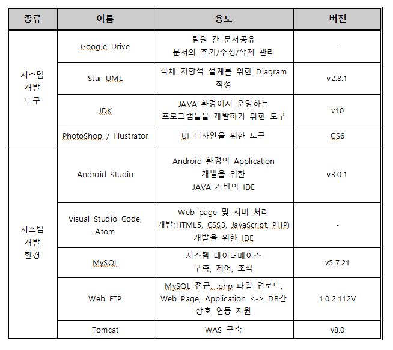
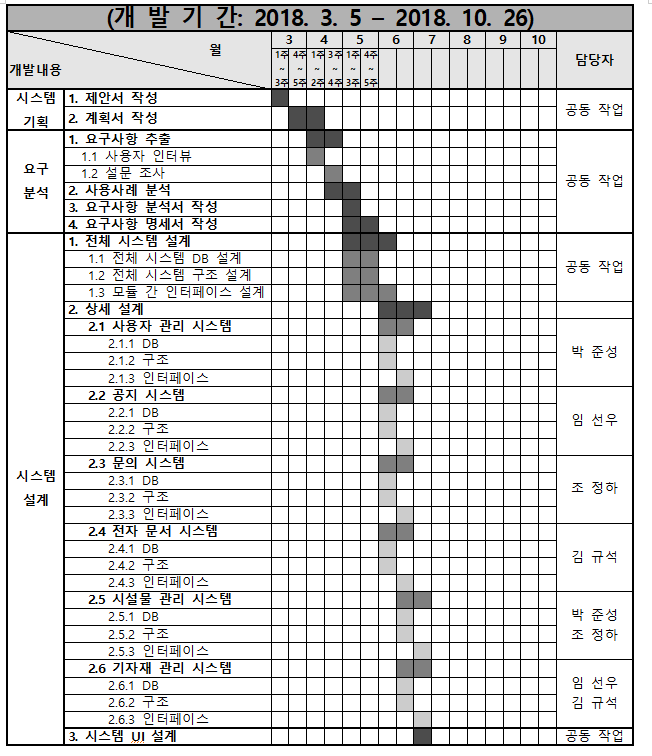
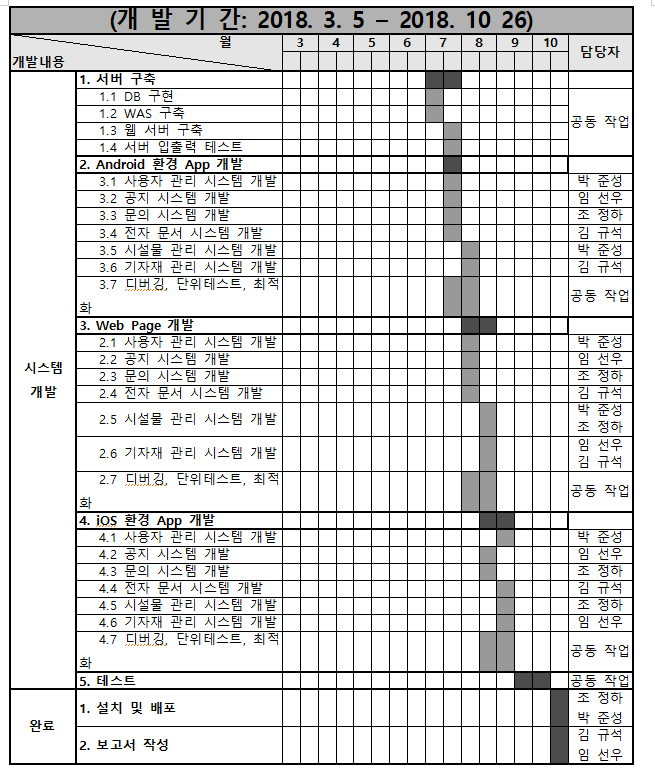
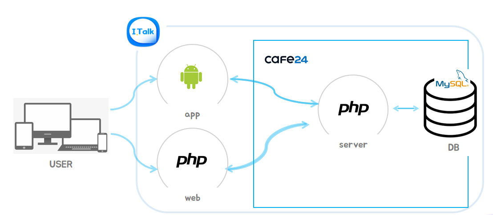
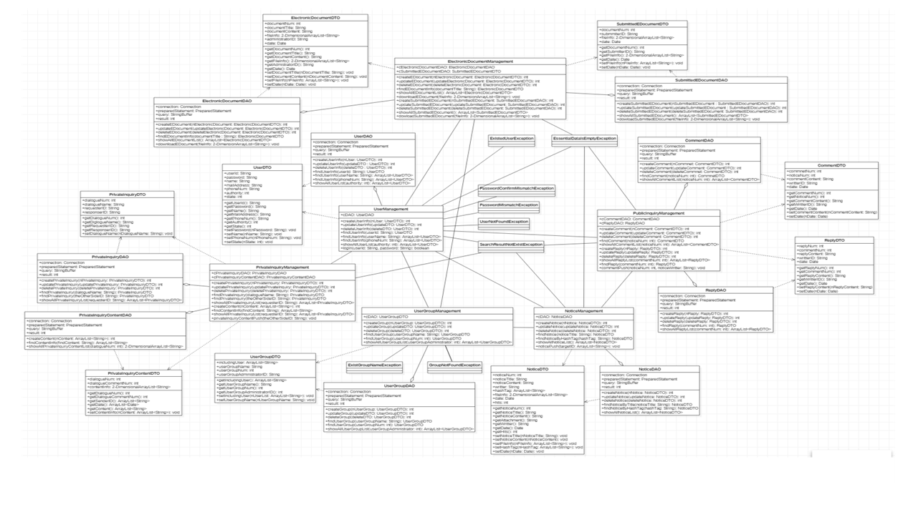
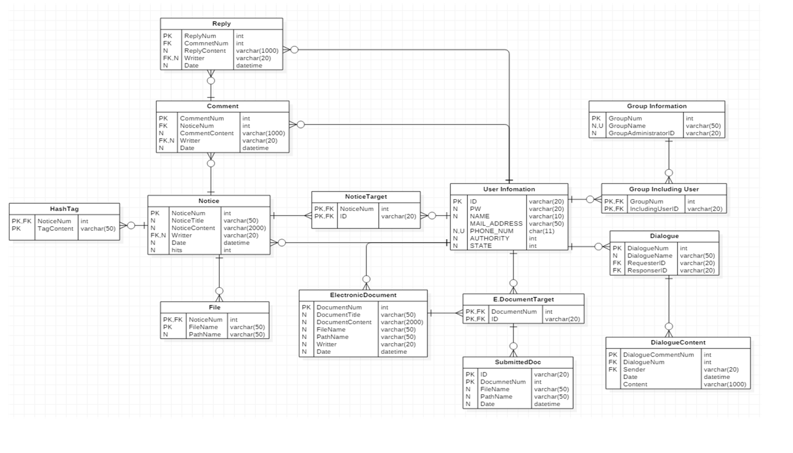
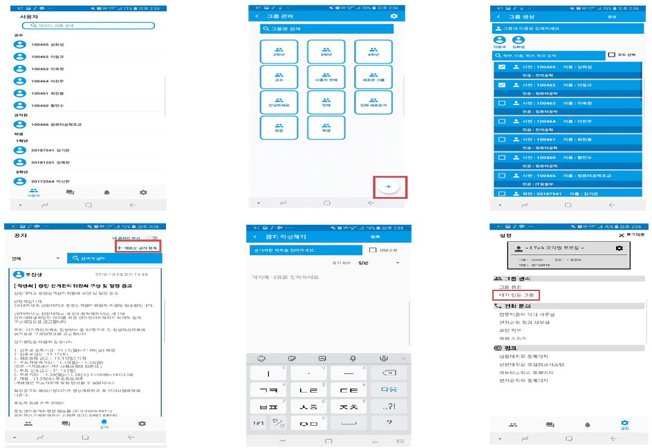
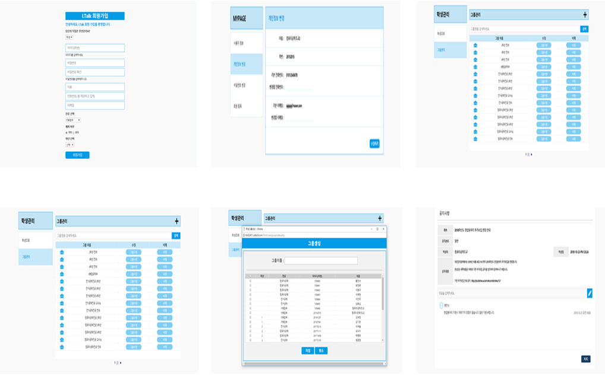

## I.Talk

  
  
  
  

## 개발 배경
- As is 
    - 비효율적인 반복 작업과 수작업을 통한 공지
    - 공지용 단체 카카오 톡 채팅방 부재 인원에 대한 공지 누락 발생
    - 과거 공지 내용 확인의 어려움
    - 중복되는 문의에 대한 반복되는 답변 작성
    
- To be
    - 사용자 그룹화를 통한 효율적인 공지 전달
    - 공지 대상을 지정하여 필요 인원에게 공지사항 전달
    - 필요 공지 검색 기능 제공
    - 공지사항 답변 공유
    
    
## 기술 스택

 

## 개발 과정

 

## 시스템 구성도

 

## 다이어그램

 

 

## 개발 결과
   1. Android App
    
     
   2. Web page
    
     

## 개발 후기
   - 개발 프로세스를 직접 경험해보며 이해할 수 있는 좋은 경험이었다.
   - 안드로이드 프로그래밍, 웹 프로그래밍의 기초를 다질 수 있었다.
   - 역량적 부족함으로 인해 어려움도 많았지만 그만큼 보람도 있었으며 얻어가는 것이 더 많다고 생각한다. 
   - 졸업프로젝트를 마무리하며 내가 많이 부족하다는 점과 나의 대학생활도 마무리 되어간다는 아쉬움을 느꼈지만 이런 경험들이 앞으로 내가 해 나가야할      일들에 많은 도움이 될 수 있을 것 같다고 생각한다.

